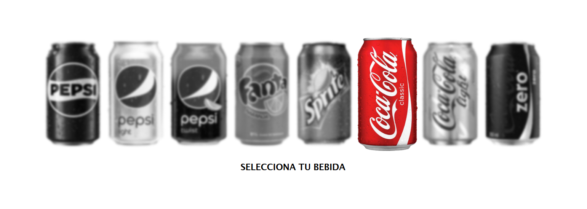

# 🥤 Galería Interactiva de Bebidas

## 👀 Vista General


## 📝 Descripción
Una elegante galería interactiva que muestra una colección de bebidas gaseosas populares. El proyecto implementa efectos visuales modernos y animaciones CSS para crear una experiencia de usuario única al seleccionar bebidas.

## ✨ Características
- 🎯 Interfaz minimalista y elegante
- 🌊 Efectos de hover con desenfoque
- 📱 Diseño totalmente responsive
- 🎨 Efectos de escala al interactuar
- ⚡ Optimizado para rendimiento
- 🖼️ Galería grid con 8 bebidas populares

## 🛠️ Tecnologías Utilizadas


## 🚀 Instalación
1. Clona el repositorio:
```bash
git clone https://github.com/gianmattus-programmer/galeria-bebidas.git
```

2. Abre `index.html` en tu navegador preferido

## 💻 Estructura del Proyecto
```
gaseosas/
├── index.html
├── style.css
├── README.md
├── screenshots/
│   └── general-view.png
└── images/
    ├── pepsi.png
    ├── pepsilight.png
    ├── pepsitwist.png
    ├── fanta.png
    ├── sprite.png
    ├── cocacola.png
    ├── cocacolalight.png
    └── cocacolazero.png
```

## 🎮 Características de Interacción
- Efecto de escala al hover sobre las bebidas
- Desenfoque de elementos no seleccionados
- Transiciones suaves en todas las interacciones
- Diseño centrado optimizado para visualización

## 👨‍💻 Autor
[@gianmattus-programmer](https://github.com/gianmattus-programmer)

## 📄 Licencia
Este proyecto está bajo la Licencia MIT. Ver el archivo [LICENSE](LICENSE) para más detalles.

## 🌟 Contribuciones
Las contribuciones son bienvenidas:

1. Haz Fork del proyecto
2. Crea tu rama de característica (`git checkout -b feature/NuevaCaracteristica`)
3. Haz commit de tus cambios (`git commit -m 'Añadir nueva característica'`)
4. Haz Push a la rama (`git push origin feature/NuevaCaracteristica`)
5. Abre un Pull Request

## 🙏 Agradecimientos
- Inspirado en interfaces modernas de selección de productos
- Imágenes cortesía de sus respectivas marcas
- Comunidad de desarrolladores por su apoyo continuo
